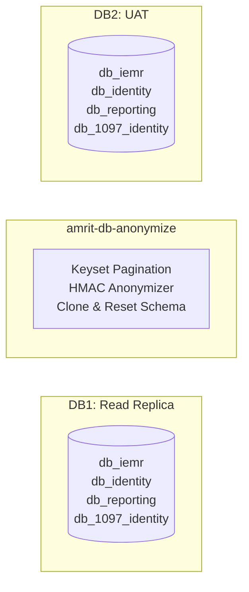

# AMRIT Database Anonymization - User Guide

## Table of Contents

1. [Overview](#overview)
2. [Architecture](#architecture)
3. [Prerequisites](#prerequisites)
4. [Quick Start](#quick-start)
5. [Configuration](#configuration)
6. [Anonymization Rules](#anonymization-rules)
7. [Command-Line Usage](#command-line-usage)
8. [Safety Model](#safety-model)
9. [Troubleshooting](#troubleshooting)
10. [FAQ](#faq)

## Overview

The AMRIT Database Anonymization Tool streams data from a production read replica (DB1) to a UAT database (DB2), applying deterministic HMAC-based anonymization to sensitive fields.

### What This Tool Does

- Connects to DB1 read replica (never production master)
- Processes multiple schemas in one command: db_iemr, db_identity, db_reporting, db_1097_identity
- Streams billions of rows efficiently using keyset pagination
- Resets target schemas before writing (DROP/CREATE or DELETE fallback)
- Clones table structures from source to target
- Applies deterministic HMAC anonymization (same input always produces same output)
- Writes directly to DB2 (no intermediate files)
- Enforces production safety with allowlists and approval tokens
- Logs only PII-safe metrics (counts, timings, hashed IDs)
- Validates configuration and rules before execution

### What This Tool Does NOT Do

- Does NOT create SQL dump files
- Does NOT connect to production master databases
- Does NOT log or store raw PII data
- Does NOT use OFFSET-based pagination
- Does NOT require lookup tables for consistency

### Key Features

- Multi-schema processing in single run
- Keyset pagination for O(log n) performance
- HMAC-SHA256 deterministic anonymization
- Multi-layer safety guards (allowlist, denylist, approval tokens)
- PII-safe logging (counts and timings only)
- Schema drift detection (diff-schema command)
- Registry YAML for rules and properties for runtime configuration

## Architecture


## Configuration

  ### Configuration File Format and Precedence

  The project uses Spring `.properties` files for runtime configuration and a single registry file for anonymization rules. Follow this precedence and edit the files below when configuring the system:

  - Rules (source of truth): `src/main/resources/anonymizer/anonymization-registry.yml`.
  - Runtime settings: `src/main/environment/common_local.properties` for local overrides (gitignored).
  - Environment variables override properties for secrets (for example `HMAC_SECRET_KEY`).


  The CLI prefers runtime values from `anonymizer.*` properties(see below) and
  environment variables for secrets. Migrate any prior runtime settings into
  `src/main/environment/common_local.properties`.
- Required runtime secrets should be supplied via environment variables (for example `HMAC_SECRET_KEY`).

Example (what to copy into `common_local.properties`):

```
# anonymizer.source.host=localhost
# anonymizer.source.port=3306
# anonymizer.source.schemas=dbiemr,db_identity,db_reporting,db_1097_identity
# anonymizer.source.username=root
# anonymizer.source.password=...
# anonymizer.target.host=localhost
# anonymizer.target.username=root
# anonymizer.target.password=...
# anonymizer.hmacSecretKey=${HMAC_SECRET_KEY}
# anonymizer.safety.operationId=OPERATION_2026_02_20
```

The CLI will automatically use the `anonymizer.*` keys from Spring properties when a YAML config is not supplied.

The tool writes anonymized data directly to the configured target database (DB2). Ensure the
source is configured as a read-only replica and that safety checks are enabled before running
against production-adjacent resources.

### 4. Set Environment Variables

```bash
# Windows PowerShell
$env:DB_READ_PASSWORD="your_readonly_password"
$env:DB_WRITE_PASSWORD="your_uat_password"
$env:HMAC_SECRET_KEY="$(openssl rand -hex 32)"

# Linux/Mac
export DB_READ_PASSWORD="your_readonly_password"
export DB_WRITE_PASSWORD="your_uat_password"
export HMAC_SECRET_KEY="$(openssl rand -hex 32)"
```

### 5. Run Anonymization

Use the `anonymizer.*` properties or environment variables.

```bash
# Dry run (validation only)
mvn exec:java "-Dexec.args=run --operation-id PROD_REFRESH_2026_FEB --dry-run"

# Actual execution
mvn exec:java "-Dexec.args=run --operation-id PROD_REFRESH_2026_FEB"
```

Output:
```
[INFO] Safety check: PASSED
[INFO] Processing schema: db_iemr
[INFO]   Resetting schema db_iemr...
[INFO]   Cloning 45 table structures...
[INFO]   Processing table m_beneficiaryregidmapping (125000 rows)...
[INFO]     Progress: 50000/125000 (40%)
[INFO]     Progress: 100000/125000 (80%)
[INFO]     Completed: 125000 rows in 45s
[INFO] Processing schema: db_identity
...
[INFO] Anonymization completed successfully
[INFO] Report saved: run-report.json
```

### 6. Verify Results

Check `run-report.json`:
```json
{
  "timestamp": "2026-02-06T10:30:00Z",
  "status": "SUCCESS",
  "schemas": [
    {
      "name": "db_iemr",
      "tables": [
        {
          "name": "m_beneficiaryregidmapping",
          "rowsProcessed": 125000,
          "columnsAnonymized": 3,
          "durationMs": 45000,
          "strategyCounts": {
            "HMAC_HASH": 3,
            "PRESERVE": 5
          }
        }
      ]
    }
  ],
  "totalDurationMs": 3600000,
  "configHash": "a3f2c8d1..."
}
```

## Configuration

### Configuration File Format

Runtime configuration (recommended): use `src/main/environment/common_local.properties` with keys prefixed by `anonymizer.` (for example `anonymizer.source.host`, `anonymizer.target.username`). An example file is available at [src/main/environment/common_example.properties](src/main/environment/common_example.properties#L1-L120). Supply secrets via environment variables when possible (for example `HMAC_SECRET_KEY`).

Rules (source of truth): use `src/main/resources/anonymizer/anonymization-registry.yml` for per-database/table/column strategies.

### Complete Configuration Reference

### Complete Configuration Reference

```yaml
# Source Database (Production Read Replica)
source:
  host: db-replica.prod.example.com
  port: 3306
  schemas:
    - db_iemr
    - db_identity
    - db_reporting
    - db_1097_identity
  username: readonly_user
  password: ${DB_READ_PASSWORD}
  readOnly: true                    # Enforced safety
  connectionTimeout: 30000          # 30 seconds

# Target Database (UAT)
target:
  host: uat-db.example.com
  port: 3306
  schemas:
    - db_iemr
    - db_identity
    - db_reporting
    - db_1097_identity
  username: uat_user
  password: ${DB_WRITE_PASSWORD}
  connectionTimeout: 30000

# Safety Configuration
safety:
  enabled: true
  allowedHosts:
    - db-replica.prod.example.com
  deniedPatterns:
    - "*prod-master*"
    - "*production-primary*"
  requireExplicitApproval: true
  approvalFlag: PROD_REFRESH_2026_FEB  # Change monthly

# Performance Tuning
performance:
  batchSize: 1000      # Rows per INSERT batch
  fetchSize: 1000      # JDBC fetch size
  maxMemoryMb: 512     # JVM heap limit

# HMAC Secret (store securely)
hmacSecretKey: ${HMAC_SECRET_KEY}

# Rules file path
rulesFile: src/main/resources/anonymizer/anonymization-registry.yml
```

### Environment Variable Substitution

Use `${VAR_NAME}` syntax for sensitive values:

```yaml
source:
  password: ${DB_READ_PASSWORD}
target:
  password: ${DB_WRITE_PASSWORD}
hmacSecretKey: ${HMAC_SECRET_KEY}
```

Set in environment:
```bash
export DB_READ_PASSWORD="secret"
export DB_WRITE_PASSWORD="secret"
export HMAC_SECRET_KEY="$(openssl rand -hex 32)"
```

## Anonymization Rules

### Rules File Format

Anonymization rules live in `src/main/resources/anonymizer/anonymization-registry.yml`.
Edit that file to configure per-database, per-table, per-column strategies and metadata.

### Available Strategies

Supported strategies include:

- `HASH_SHA256` — One-way hash (deterministic, linkable)
- `HMAC_HASH` — HMAC-based one-way hash (deterministic, keyed)
- `RANDOM_FAKE_DATA` — Realistic fake data using java-faker (can be deterministic if seeded)
- `PARTIAL_MASK` — Mask characters (show last N digits)
- `GENERALIZE` — Category/range reduction
- `SUPPRESS` — Replace with NULL
- `PRESERVE` — Keep original value

### Rules Structure

Before anonymizing data, the tool resets target schemas using one of these strategies:

### Schema Reset Strategies

Before anonymizing, the tool resets target schemas using one of these methods:

**Strategy 1: DROP and CREATE (Preferred)**
```sql
DROP DATABASE IF EXISTS db_iemr;
CREATE DATABASE db_iemr CHARACTER SET utf8mb4 COLLATE utf8mb4_unicode_ci;
```
Requires: DROP and CREATE privileges

**Strategy 2: DELETE (Fallback)**
```sql
SET FOREIGN_KEY_CHECKS = 0;
DELETE FROM db_iemr.table1;
DELETE FROM db_iemr.table2;
...
SET FOREIGN_KEY_CHECKS = 1;
```
Requires: DELETE privilege on all tables

The tool automatically attempts Strategy 1, then falls back to Strategy 2 if needed.

## Command-Line Usage

### Running Commands

Run the CLI directly from the packaged classes (recommended) or use Maven exec as an alternative. The direct-run avoids starting the Spring web server and is preferred for local `--dry-run` validation.

**Important Notes:**  
- The CLI is a standalone application; `java -cp` avoids starting a web server.  
- Use double quotes on Windows classpaths and single quotes on Linux/macOS.  
- Ensure `target/dependency` contains a compatible `snakeyaml-2.x` JAR (remove old `snakeyaml-*-android.jar` if present).

1. Copy runtime dependencies to `target/dependency`:

```bash
mvn dependency:copy-dependencies -DoutputDirectory=target/dependency -DincludeScope=runtime
```

2. Run the CLI (Windows):

```powershell
java -cp "target/classes;target/dependency/*" com.db.piramalswasthya.anonymizer.AmritDbAnonymizer run -c src/main/environment/common_local.properties --dry-run
```

Or (Linux/macOS):

```bash
java -cp 'target/classes:target/dependency/*' com.db.piramalswasthya.anonymizer.AmritDbAnonymizer run -c src/main/environment/common_local.properties --dry-run
```

### View Help

```bash
# Main help
mvn exec:java "-Dexec.args=--help"

# Command-specific help
mvn exec:java "-Dexec.args=run --help"
mvn exec:java "-Dexec.args=diff-schema --help"
```

### run Command

Anonymize and restore database from source to target.

**Required Options:**
- `--operation-id ID` - Operation identifier (recommended; can also be set via `anonymizer.safety.operationId` in properties)

**Optional Options:**
- `--dry-run` - Validate configuration without executing

**Examples:**

```bash
# Normal execution (uses anonymizer.* properties from Spring environment)
mvn exec:java "-Dexec.args=run --operation-id OPERATION_2026_02_20"

# Dry run (validation only)
mvn exec:java "-Dexec.args=run --operation-id OPERATION_2026_02_20 --dry-run"
```

**Exit Codes:**
- `0` - Success
- `1` - Validation or execution error

### diff-schema Command

Compare database schemas with anonymization-registry.yml to detect schema drift.

**Options:**
- `-r, --rules FILE` - Rules file (default: src/main/resources/anonymizer/anonymization-registry.yml)
- `-o, --output FILE` - Write suggested rules to file (optional)

**Examples:**

```bash
# Compare schema with rules (uses anonymizer.* properties from Spring environment)
mvn exec:java "-Dexec.args=diff-schema --rules src/main/resources/anonymizer/anonymization-registry.yml"

# Generate suggested rules for new columns
mvn exec:java "-Dexec.args=diff-schema --rules src/main/resources/anonymizer/anonymization-registry.yml --output suggested-anonymization-registry.yml"
```

### Exit Codes

| Code | Meaning | Action |
|------|---------|--------|
| 0 | Success | Anonymization completed |
| 1 | Error | Check run-report.json for details |

## Safety Model

### Common Issues

#### Issue: "Safety check failed - host not in allowlist"

**Symptoms:**
```
DENIED: Host 'db-server.example.com' not in allowlist
```

**Solution:**
1. Verify you're connecting to correct read replica
2. Add host to anonymizer properties (`src/main/resources/anonymizer/*.properties` or `src/main/environment/common_local.properties`):
  ```properties
  anonymizer.safety.allowedHosts=db-server.example.com
  ```
3. Provide approval flag: `--approval-flag "..."`

#### Issue: "Connection timeout to database"

**Symptoms:**
```
ERROR: Failed to connect to db-replica:3306 after 30s
```

**Solution:**
1. Check network connectivity: `telnet db-replica 3306`
2. Verify credentials: `mysql -h db-replica -u user -p`
3. Increase timeout in anonymizer properties (or `common_local.properties`):
  ```properties
  anonymizer.source.connectionTimeout=60000
  ```

#### Issue: "Out of memory error"

**Symptoms:**
```
java.lang.OutOfMemoryError: Java heap space
```

**Solution:**
1. Reduce batch size in anonymizer properties (or `common_local.properties`):
  ```properties
  anonymizer.performance.batchSize=500
  anonymizer.performance.fetchSize=500
  ```
2. Increase JVM heap:
   ```bash
   java -Xmx4g -jar target/Amrit-DB-2.0.0.war run ...
   ```

#### Issue: "Unknown column in rules"

**Symptoms:**
```
WARN: Column 'NewColumn' in table 't_patients' not found in anonymization-registry.yml
```

**Solution:**
1. Run schema diff (write suggestions to a file):
  ```bash
  mvn exec:java "-Dexec.args=diff-schema --rules src/main/resources/anonymizer/anonymization-registry.yml --output new-anonymization-registry.yml"
  ```
2. Review `new-anonymization-registry.yml`
3. Merge into `src/main/resources/anonymizer/anonymization-registry.yml`
4. Re-run with updated rules

#### Issue: "Primary key not defined for table"

**Symptoms:**
```
ERROR: Table 't_visits' missing primaryKey in anonymization-registry.yml
```

Solution:
Add primary key to `src/main/resources/anonymizer/anonymization-registry.yml`:
```yaml
databases:
  db_iemr:
    tables:
      t_visits:
        primaryKey: VisitID  # <-- Add this
        columns:
          ...
```

### Debug Mode

Enable detailed logging:

```bash
# Set logging level to DEBUG
export LOGGING_LEVEL=DEBUG

# Run with debug logging
mvn exec:java "-Dexec.args=run --operation-id TOKEN"
```

**Log Output (PII-Safe):**
```
DEBUG KeysetPaginator: Fetching batch WHERE BenRegID > 12345 LIMIT 1000
DEBUG HmacAnonymizer: Hashed ID count=1000, avg_time=0.5ms
INFO  Progress: Table m_beneficiaryregidmapping - 50000/500000 rows (10%)
```

### Log Files

**Location**: `./logs/anonymization-YYYYMMDD-HHMMSS.log`

**Contains (PII-Safe)**:
- Start/end timestamps
- Tables processed
- Row counts per table
- Processing times
- Errors (no sensitive data)
- Configuration hash
- Rules version

**Example Log:**
```json
{
  "timestamp": "2026-02-05T10:00:00Z",
  "event": "table_completed",
  "table": "m_beneficiaryregidmapping",
  "rowsProcessed": 125000,
  "durationMs": 45000,
  "strategy": "HASH",
  "columnsAnonymized": 8
}
```

## FAQ

### Q1: How do I handle schema changes?

**A:** Use the diff-schema command regularly:

```bash
# Weekly check
mvn exec:java "-Dexec.args=diff-schema --rules src/main/resources/anonymizer/anonymization-registry.yml --output schema-changes.yaml"

# Review changes
cat schema-changes.yaml

# Update rules (merge into the registry file)
vi src/main/resources/anonymizer/anonymization-registry.yml

# Commit to version control
git add src/main/resources/anonymizer/anonymization-registry.yml
git commit -m "Add rules for new columns in Q1-2026 schema"
```

### Q2: Can I run this in parallel for multiple databases?

**A:** Yes, but use separate config files:

```bash
# Terminal 1: db_iemr (properties point to db_iemr)
mvn exec:java "-Dexec.args=run --operation-id OP_IEMR_2026_02_20"

# Terminal 2: db_identity (properties point to db_identity)
mvn exec:java "-Dexec.args=run --operation-id OP_IDENTITY_2026_02_20"
```

### Q3: How long does anonymization take?

**A:** Depends on data size:
- 1M rows: ~5-10 minutes
- 10M rows: ~30-60 minutes
- 100M rows (crores): ~5-8 hours
- 1B rows: ~2-3 days

**Performance factors:**
- Network speed (DB1 → tool)
- Batch size (higher = faster, more memory)
- Number of columns to anonymize
- HMAC computation overhead (~100μs per value)

### Q4: Is the anonymization reversible?

**A:** **NO.** HMAC-SHA256 is one-way:
- Cannot reverse hash back to original
- Same input always produces same hash (deterministic)
- Secure for production-to-UAT workflows

### What happens if the tool crashes?

- Partial data written to DB2 (target)
- No data loss in DB1 (read-only connection)
- Re-run from beginning (no resume support)
- Consider: Drop target schemas and restart

### Q6: Can I anonymize only specific tables?

**A:** Yes, edit `src/main/resources/anonymizer/anonymization-registry.yml` to include only desired tables:

```yaml
databases:
  db_identity:
    tables:
      m_beneficiaryregidmapping:  # Only this table
        ...
      # Remove other tables
```

### Q7: How do I verify anonymization worked?

**A:** Check run-report.json:

```json
{
  "executionId": "20260205-100000",
  "status": "SUCCESS",
  "tables": [
    {
      "name": "m_beneficiaryregidmapping",
      "rowsProcessed": 125000,
      "columnsAnonymized": 8,
      "strategyCounts": {
        "HMAC_HASH": 3,
        "PRESERVE": 5
      }
    }
  ],
  "totalDurationMs": 180000,
  "configHash": "a3f2c8...",
  "rulesVersion": "2.0.0"
}
```

Spot-check UAT database:
```sql
SELECT BenRegID, FirstName, PhoneNo FROM m_beneficiaryregidmapping LIMIT 10;

-- Should see:
-- BenRegID: long hex hash (64 chars)
-- FirstName: long hex hash (64 chars)
-- PhoneNo: long hex hash (64 chars)
```

### Q8: How secure is the HMAC secret key?

**A:** **CRITICAL SECURITY:**
- Store in environment variable or secret manager
- Never commit to version control
- Rotate periodically (quarterly recommended)
- Use 32+ character random string:
  ```bash
  openssl rand -hex 32
  ```


## Best Practices

1. **Always Use Read Replicas**
   - Never connect to production master
   - Use dedicated read replica with lag monitoring

2. **Rotate Approval Flags Monthly**
   ```yaml
   safety:
     approvalFlag: "I_CONFIRM_UAT_REFRESH_2026_FEB"  # Change monthly
   ```

3. **Version Control Your Rules**
  ```bash
  git add src/main/resources/anonymizer/anonymization-registry.yml
  git commit -m "Update rules for Q1-2026 schema"
  git tag anonymization-rules-2026-Q1
  ```

4. **Run Diff-Schema Weekly**
   ```bash
   # Cron job: Every Monday 6 AM (Linux)
  0 6 * * 1 cd /path/to/AMRIT-DB && mvn exec:java "-Dexec.args=diff-schema"
   ```

5. **Test on Staging First**
   ```bash
  # Staging run (smaller dataset)
  mvn exec:java "-Dexec.args=run --operation-id STAGING_RUN_2026"
   
  # If successful, run production (ensure anonymizer.safety.operationId and secrets are set)
  mvn exec:java "-Dexec.args=run --operation-id PRODUCTION_RUN_2026"
   ```

6. **Monitor Execution**
   - Check run-report.json after completion
   - Verify row counts match expectations
   - Spot-check anonymized data in UAT

7. **Keep Logs**
   ```bash
   # Archive logs for audit trail
   tar -czf logs-$(date +%Y%m%d).tar.gz logs/
   aws s3 cp logs-$(date +%Y%m%d).tar.gz s3://audit-bucket/
   ```

## Support

For issues or questions:
- GitHub Issues: https://github.com/PSMRI/AMRIT-DB/issues
- Email: support@piramalswasthya.org
- Internal Wiki: [AMRIT DB Anonymization](link)

## Appendix

### A. Full Config Reference

See `src/main/environment/common_example.properties` for example runtime properties

### B. Full Rules Reference

See `src/main/resources/anonymizer/anonymization-registry.yml` for the canonical rules registry

### C. Architecture Diagram

See [architecture diagram.png](architecture%20diagram.png)

### D. Command Reference Quick Guide

**All commands use Maven exec plugin:**

```bash
# View all commands
mvn exec:java "-Dexec.args=--help"

# Run anonymization
mvn exec:java "-Dexec.args=run --operation-id TOKEN"

# Dry run (validation)
mvn exec:java "-Dexec.args=run --operation-id TOKEN --dry-run"

# Compare schema
mvn exec:java "-Dexec.args=diff-schema --rules src/main/resources/anonymizer/anonymization-registry.yml"

# Get help for specific command
mvn exec:java "-Dexec.args=run --help"
mvn exec:java "-Dexec.args=diff-schema --help"
```

**Key Features:**
- Direct DB-to-DB streaming (no SQL dump files)
- Multi-schema processing (db_iemr, db_identity, db_reporting, db_1097_identity)
- HMAC-SHA256 deterministic anonymization
- Keyset pagination for efficient large-dataset processing
- Production safety guards (allowlist, operation identifier)
- PII-safe logging (only metrics, no sensitive data)

